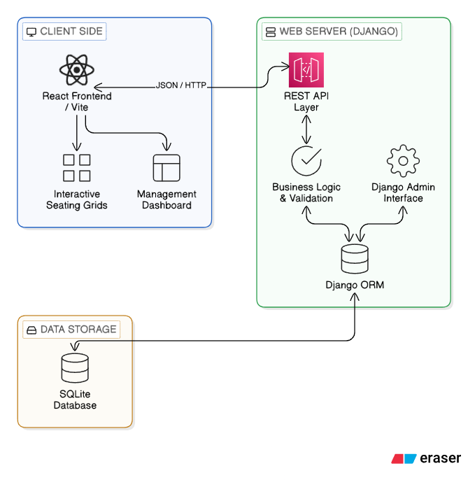
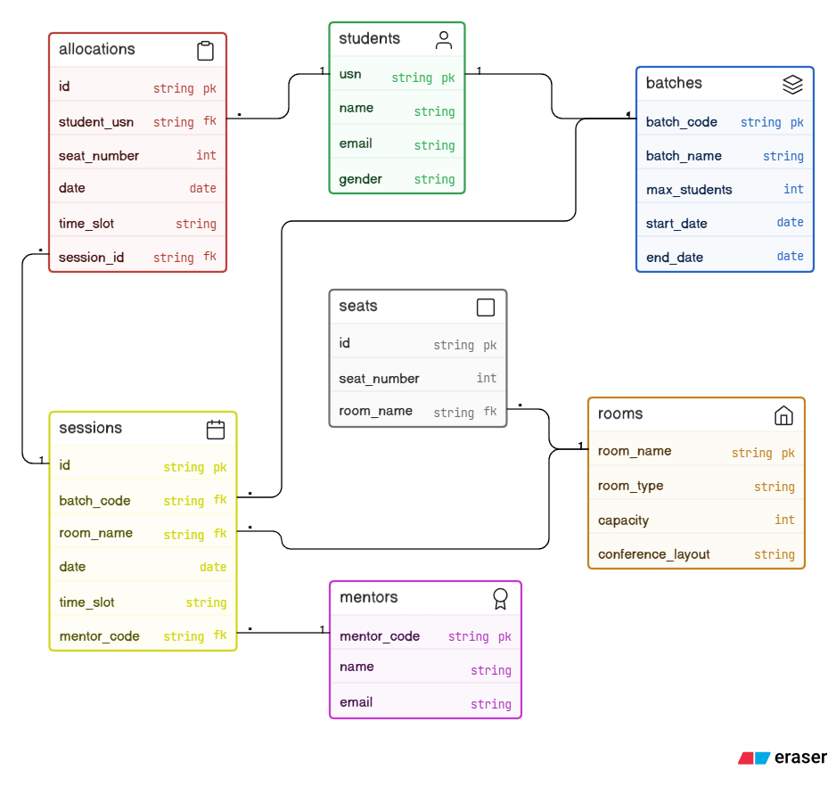

<!-- Improved compatibility of back to top link: See: https://github.com/othneildrew/Best-README-Template/pull/73 -->
<a id="readme-top"></a>

<!-- PROJECT LOGO -->
<br />
<div align="center">
  <h3 align="center">AI Seat Allocator & Management System</h3>
  <p align="center">
    A Semantic-Aware Room Allotment Engine powered by Local LLMs and NL-to-SQL.
    <br />
    <a href="https://github.com/Shashwath-K/seat_allocator_dbms"><strong>Explore the docs »</strong></a>
    <br />
    <br />
    <a href="#">View Demo</a>
    &middot;
    <a href="https://github.com/Shashwath-K/seat_allocator_dbms/issues">Report Bug</a>
    &middot;
    <a href="https://github.com/Shashwath-K/seat_allocator_dbms/issues">Request Feature</a>
  </p>
</div>

<!-- TABLE OF CONTENTS -->
<details>
  <summary>Table of Contents</summary>
  <ol>
    <li>
      <a href="#about-the-project">About The Project</a>
      <ul>
        <li><a href="#built-with">Built With</a></li>
      </ul>
    </li>
    <li>
      <a href="#getting-started">Getting Started</a>
      <ul>
        <li><a href="#prerequisites">Prerequisites</a></li>
        <li><a href="#installation">Installation</a></li>
      </ul>
    </li>
    <li><a href="#usage">Usage</a></li>
    <li><a href="#roadmap">Roadmap</a></li>
    <li><a href="#contributing">Contributing</a></li>
    <li><a href="#license">License</a></li>
    <li><a href="#contact">Contact</a></li>
    <li><a href="#acknowledgments">Acknowledgments</a></li>
  </ol>
</details>

<!-- ABOUT THE PROJECT -->
## About The Project

The **AI Seat Allocator & Management System** is a sophisticated architectural solution designed to automate and optimize the complex task of room allotment in educational and corporate environments. By integrating **Local Large Language Models (via Ollama)**, it enables administrators to manage batches, rooms, and assignments using intuitive natural language.

### Key Features:
* **Conversational AI Interface**: Query the database using English (e.g., "Which rooms are empty today?") powered by a robust NL-to-SQL engine.
* **Intelligent Allotment Proposals**: Don't just automate—collaborate. The AI suggests optimized seating plans (Sequential or Shuffle) which are executed only after human-in-the-loop confirmation.
* **Specialized Room Support**: 
    - **Labs**: System-constrained layouts with student-to-hardware mapping.
    - **Conference Rooms**: Variable row configurations for executive seating.
    - **Regular Classrooms**: Matrix-based seating with row/column optimization.
* **Conflict-Aware Scheduling**: Automatic detection of double-bookings for rooms, mentors, and student batches across specific dates and time slots (FN/AN).
* **Audit Logging**: Comprehensive system logs tracking minden change, from batch creation to seat reallocation.

<p align="right">(<a href="#readme-top">back to top</a>)</p>

### Built With

This project leverages a modern full-stack architecture for performance and local-first intelligence:

[![React][React]][React-url][![Vite][Vite]][Vite-url][![Django][Django]][Django-url][![Ollama][Ollama]][Ollama-url][![SQLite][SQLite]][SQLite-url][![Lucide][Lucide]][Lucide-url]

<p align="right">(<a href="#readme-top">back to top</a>)</p>

<!-- GETTING STARTED -->
## Getting Started

To set up a local development environment, follow these steps.

### Prerequisites

* **Python 3.10+**
* **Node.js 18+**
* **Ollama** (Running locally with `smollm2:135m` or `llama3.2`)
  ```sh
  ollama run smollm2:135m
  ```

### Installation

1. Clone the repo
   ```sh
   git clone https://github.com/Shashwath-K/seat_allocator_dbms.git
   ```
2. **Backend Setup**
   ```sh
   python -m venv venv
   source venv/bin/activate  # Windows: venv\Scripts\activate
   pip install django django-cors-headers  # and other dependencies
   python manage.py migrate
   python manage.py runserver
   ```
3. **Frontend Setup**
   ```sh
   cd frontend
   npm install
   npm run dev
   ```

<p align="right">(<a href="#readme-top">back to top</a>)</p>

<!-- USAGE EXAMPLES -->
## Usage

### 1. System Architecture
Comprehensive view of how the Semantic-Aware Allotment Engine processes natural language into actionable database operations.


### 2. Database Schema (ERD)
Detailed ER/UML mapping showing relationships between Batches, Students, Rooms, Mentors, and Allocations.


### 3. AI Allocator Console
The central hub for natural language querying. Type requests like *"Allocate batch CS-A to Room 101 tomorrow FN"* to generate instant proposals.

<p align="right">(<a href="#readme-top">back to top</a>)</p>

<!-- ROADMAP -->
## Roadmap

- [x] NL-to-SQL Query Engine
- [x] AI-Powered Allocation Proposals
- [x] Multi-type Room Layout Logic
- [ ] PDF/Excel Allotment Report Exports
- [ ] Multi-tenant Institution Support
- [ ] Mobile App for On-the-go Room Checking

<p align="right">(<a href="#readme-top">back to top</a>)</p>

<!-- CONTRIBUTING -->
## Contributing

Contributions are what make the open source community such an amazing place to learn, inspire, and create. Any contributions you make are **greatly appreciated**.

1. Fork the Project
2. Create your Feature Branch (`git checkout -b feature/AmazingFeature`)
3. Commit your Changes (`git commit -m 'Add some AmazingFeature'`)
4. Push to the Branch (`git push origin feature/AmazingFeature`)
5. Open a Pull Request

<p align="right">(<a href="#readme-top">back to top</a>)</p>

<!-- LICENSE -->
## License

Distributed under the Unlicense License. See `LICENSE` for more information (if applicable).

<p align="right">(<a href="#readme-top">back to top</a>)</p>

<!-- CONTACT -->
## Contact

Shashwath K - [Email](shashwathkukkunoor@outlook.com)

Project Link: [https://github.com/Shashwath-K/seat_allocator_dbms](https://github.com/Shashwath-K/seat_allocator_dbms)

<p align="right">(<a href="#readme-top">back to top</a>)</p>

<!-- ACKNOWLEDGMENTS -->
## Acknowledgments

* [Ollama](https://ollama.com) for local LLM inferencing
* [Django](https://www.djangoproject.com/) for the robust backend framework
* [Lucide React](https://lucide.dev/) for the modern UI iconography
* [Best-README-Template](https://github.com/othneildrew/Best-README-Template)

<p align="right">(<a href="#readme-top">back to top</a>)</p>

<!-- MARKDOWN LINKS & IMAGES -->
[React]: https://img.shields.io/badge/React-20232A?style=for-the-badge&logo=react&logoColor=61DAFB
[React-url]: https://reactjs.org/
[Vite]: https://img.shields.io/badge/Vite-646CFF?style=for-the-badge&logo=vite&logoColor=white
[Vite-url]: https://vitejs.dev/
[Django]: https://img.shields.io/badge/Django-092E20?style=for-the-badge&logo=django&logoColor=white
[Django-url]: https://www.djangoproject.com/
[Ollama]: https://img.shields.io/badge/Ollama-000000?style=for-the-badge&logo=ollama&logoColor=white
[Ollama-url]: https://ollama.com/
[SQLite]: https://img.shields.io/badge/SQLite-07405E?style=for-the-badge&logo=sqlite&logoColor=white
[SQLite-url]: https://www.sqlite.org/
[Lucide]: https://img.shields.io/badge/Lucide-FF4154?style=for-the-badge&logo=lucide&logoColor=white
[Lucide-url]: https://lucide.dev/
